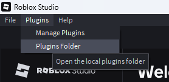
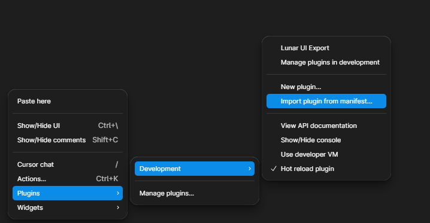

# Installation

## Lunar IDE (Angular Preview)
This is the Angular rewrite of Lunar IDE — same features, same Rust/Tauri backend, different
frontend. To install it, go to the [releases page](https://github.com/S7y1e/lunar-ide-angular/releases)
and download the executable for your OS.

> Some features require the plugins below to work.

## Lunar Bridge

### Option 1 — Manual (Recommended)
Download the plugin file from the [releases page](https://github.com/S7y1e/lunar-ide-angular/releases)
or directly from the `studio-plugin` folder in the repository, then place it in your Roblox plugins folder.

Restart Studio and it should be working.

### Option 2 — Creator Store
Install via the [Lunar plugin on Creator Store](https://create.roblox.com/store/asset/82023196611968/Lunar).

> **Note:** This version may be outdated or unavailable due to upload issues on Roblox's side.

## Figma Plugin

### Option 1 — Manual (Recommended)
Download the plugin file from the [releases page](https://github.com/S7y1e/lunar-ide-angular/releases)
or directly from the `figma-plugin` folder in the repository.

Then open Figma, inside a project go to **Plugins → Development → Import plugin from manifest**:

Select the `manifest.json` file from the `figma-plugin` folder.

### Option 2 — Figma Community
Install directly from the [Figma Community](https://www.figma.com/community/plugin/1652482448870852483).

> **Note:** This version may be outdated if I forgot to publish the latest update.